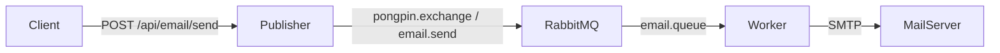

# Architecture

Pongpin has two Spring Boot applications. The publisher accepts email requests and provides the configuration dashboard. The worker consumes requests and sends the email through SMTP.

## Event flow

## Responsibilities

- **Publisher:** Hosts the dashboard and email API on port `8081`. It declares a durable direct exchange, durable email queue, and routing-key binding. The current route uses `email.send`.
- **Dashboard configuration service:** Validates submitted queue and SMTP settings, preserves a saved SMTP password when the field is left blank, and generates worker YAML.
- **Dashboard data store:** Encrypts saved settings with AES-GCM. The data and local key are stored under `~/.pongpin/` by default.
- **Dashboard account store:** Stores the dashboard login password as a BCrypt hash.
- **Worker:** Selects an adapter from `app.queue.provider`. The RabbitMQ adapter listens to the configured email queue and passes each event to the email service.
- **Email service:** Builds an HTML email from the event’s recipient, subject, and body, then sends it through the configured SMTP server.

## Scaling and current limits

Run multiple worker processes with the same RabbitMQ configuration and queue name. RabbitMQ distributes messages among consumers of that queue. Delivery can be retried if processing fails; dead-letter handling and bounded retry policy are not configured yet.

RabbitMQ is the only implemented worker adapter. The dashboard can generate Kafka or SQS settings, but selecting either provider currently fails because no matching worker adapter exists. Per-event priority routing is planned, not implemented.
