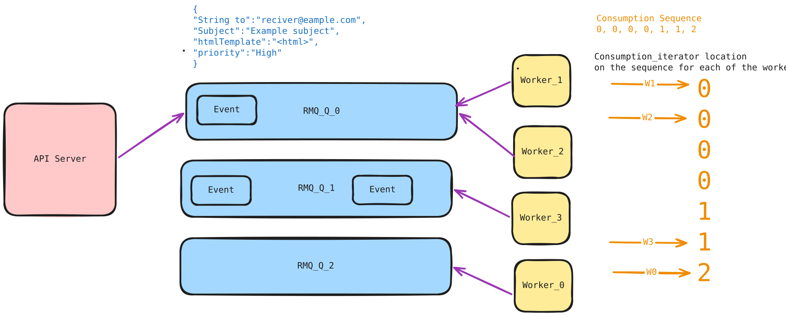
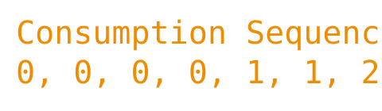

# How does the priority based scheduling work

## RabbitMQ
- We have a fixed 3 queue setup: high priority events go to Q_0, medium to Q_1, and low to Q_2.
- The sender can set the `priority` payload field to `HIGH`, `MEDIUM`, or `LOW` to route an event to its queue.

### The high level design would look like

### Trade-offs

The 3 queue setup is an decent solution for this particular problem, there do exist some visible tradeoffs that were made.

- There exists some other ways in which we could have implemented the similiar design as suggested by the official [Rabbitmq page](https://www.rabbitmq.com/docs/priority). we could have choosen to go with their **native priority queue** it could potentially cause starvation for the events with lower priority, which is not the required behaviour for us in this case.
- **Why only 3 queues ?**, The reason isnt evident, yet. im yet to benchmark this and prove.

### How is starvation prevented? 

We have a defined consumption sequence which is to be followed by evey worker. 

It refers that a worker will consume from the queues in the above order. this results in a `4:2:1` ration of consumption amongst each queues. While
starting up multiple workers there would be a need to give some random time between each startup or start them up sequentially. 
